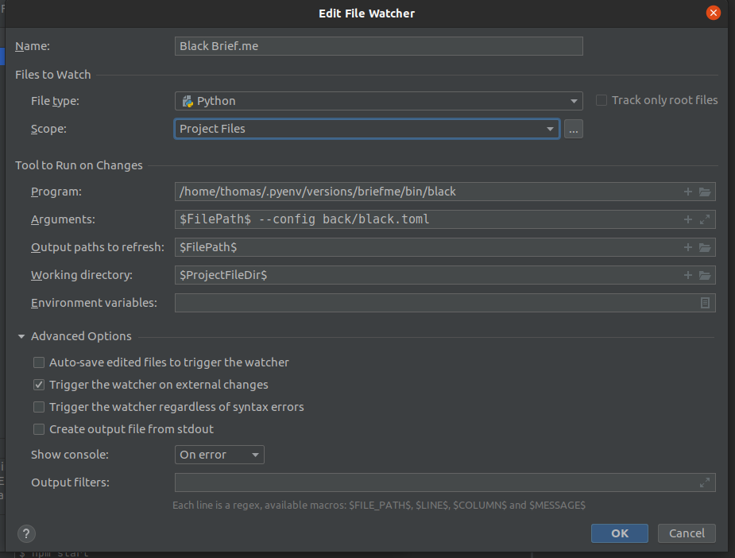

# Brief.me Guidelines
Guidelines used in Brief.me private and public projects. This document aims at :
* Improving consistency intra- and inter-projects.
* Taking tangible decisions.
* Having a reference document to refer to.
* Helping new developers working on our projects.

Those guidelines are constantly evolving and are the results of discussions 
from Brief.me's tech team and outside collaborators.

## Coding style (Django)
### Views
#### Naming Convention
View classes should be suffixed with their parent view type to clearly indicate their inheritance and purpose. 

```python
# ✅ Good examples
class EditorialListView(ListView):
    """Displays a list of editorial content."""
    pass

class UserDetailView(DetailView):
    """Shows detailed information about a user."""
    pass

# ❌ Avoid
class Editorial(ListView):  # Missing view type suffix
    pass

class PanoramaView(TemplateView):  # Generic 'View' suffix instead of specific type
    pass
```

This helps maintain consistency and improves code readability.

#### Context Data
When adding context data to Django views, prefer adding context variables individually rather than using the context.update() method. 

```python
# ✅ Good
def get_context_data(self, **kwargs):
    context = super().get_context_data(**kwargs)
    context["object_id"] = self.object.id
    context["show_paywall"] = self._show_paywall()
    return context

# ❌ Avoid
def get_context_data(self, **kwargs):
    context = super().get_context_data(**kwargs)
    context.update({
        "object_id": self.object.id,
        "show_paywall": self._show_paywall()
    })
    return context
```

This approach improves code readability, makes debugging easier, and allows for better maintainability.

#### Private methods
Methods intended for internal use within a class should be prefixed with a single underscore (_). This convention indicates that the method is private and should not be accessed from outside the class.

```python
class ArticleDetailView(DetailView):
    def get_context_data(self, **kwargs):
        context = super().get_context_data(**kwargs)
        context["related_articles"] = self._get_related_articles()
        return context
    
    #🔒 private method
    def _get_related_articles(self):
        """Internal method to fetch related articles."""
        return Article.objects.filter(category=self.object.category)
```

#### Decorators
Decorators should be placed at the method level when it exists and 
at the class level otherwise.
```python
class DummyView(View):
    
    @method_decorator(login_required)
    def dispatch(self, request, *args, **kwargs):
        if request.user.is_active:
            return HttpResponseForbidden("already active")
        return super().dispatch(request, *args, **kwargs)

...

@method_decorator(login_required, name="dispatch")
class ChangePasswordView(FormView):

    form_class = ChangePasswordForm
    template_name = "account/change_password.html"
```

When having the choice between a mixin and a decorator 
for the same functional need, we should use the decorator
(e.g.: `LoginRequiredMixin` mixin and `login_required` decorator)

### URLs
#### Naming Convention
All the routes specified into urls.py files needs a "/" at the end of paths
```python
urlpatterns = [
    path(
        "le-mot-en-suspens/<int:pk>/",
        WordOfTheDayGameView.as_view(),
        name="wordofthedaygame_detail",
    ),
    path(
        "le-mot-en-suspens/archives/",
        WordOfTheDayArchiveView.as_view(),
        name="wordofthedaygame_archive",
    ),
    path("archives/", AllGamesArchiveListView.as_view(), name="games_archive"),
    ...
]
```


### Django admin site
#### Field description
we use the display() decorator to customize how the field is presented:
```python
@admin.display(description="dernière mise à jour")
    def last_modified(self, obj):
        return obj.extendedflatpage.last_modified
```

### Signals / Handlers
#### Architecture
When it comes to signals and handlers, we should adopt the following architecture:
```
app_name    
│
└───signals
│   │   __init__.py
│   │   handlers.py
│     
│    __init__.py
│    ... 
│    apps.py 
│    ... 
```

Signal handlers should live in `app_name/signals/handlers.py`:
```python
from django.db.models.signals import pre_save
from django.dispatch import receiver
from myapp.models import MyModel

@receiver(pre_save, sender=MyModel)
def my_handler(sender, **kwargs):
    pass
```

Handlers should be registered in `app_name/apps.py`:
```python
from django.apps import AppConfig

class AppNameConfig(AppConfig):
    name = 'app_name'
    verbose_name = "App names"

    def ready(self):
        import app_name.signals.handlers #noqa
```

Make sure that `AppNameConfig` is loaded in `app_name/__init__.py`:
```python
default_app_config = "app_name.apps.AppNameConfig"
```

If you need to provide signals for other apps to listen to, you must do it in `app_name/signals/__init__.py`:
```python
import django.dispatch

my_signal = django.dispatch.Signal(providing_args=["dummy_arg"])
```

Another app can listen to the signal by using `from app_name.signals import my_signal`

### ObjectDoesNotExist
When handling exceptions for objects that do not exist, we should prioritize the use of `ObjectDoesNotExist` over `Model.ModelDoesNotExist`.

```python
# ✅ Good
from django.core.exceptions import ObjectDoesNotExist

try:
    user = User.objects.get(id=user_id)
except ObjectDoesNotExist:
    # Handle the case where the user does not exist
    pass

# ❌ Avoid
from myapp.models import User

try:
    user = User.objects.get(id=user_id)
except User.DoesNotExist:
    # Handle the case where the user does not exist
    pass
```

This approach provides better code consistency, avoids importing each model specifically to handle its exceptions, makes the code more generic and facilitates better error handling.

### Chargify calls
When calling an endpoint to the Chargify's API, we should always use the methods within the `ChargifyHelper` class.
`chargify_python` should only be used within `ChargifyHelper` methods.

### Code formatting
Code formatting is handled by [black](https://github.com/psf/black). We use the default configuration of 88 characters per line
for open source and shared apps and a value of 99 characters for `briefme_cms` `brief.eco`, `brief.science` and `briefme-core`.

#### Optional: PyCharm users
You can create a file watcher by going into `File->Settings...->Tools->File Watchers` and create a new entry with the following config:

This will trigger black without you noticing it.


## Commit formatting
The philosophy of this specification is based on [conventional commits](https://www.conventionalcommits.org/en/).
We adapted it to fit our business needs and habits.

Here is the list of verbs with their usage that must be used in our projects:

| Verbs         | Usage                                                                             |
| ------------- |:---------------------------------------------------------------------------------:|
| fix           | Patch a bug                                                                       |
| feat          | Add new feature                                                                   |
| refactor      | A code change that neither fixes a bug nor adds a feature                         |
| style         | Changes that do not affect the meaning of the code (white-space, formatting, ...) |
| docs          | Documentation only changes                                                        |
| chore         | Changes to configuration files (CI, Makefile, pytest.ini, black.toml, ...)        |
| test          | Adding missing tests or correcting existing tests                                 |

Examples of usage:
```
git commit -m "feat(editorial): allow admin user to see draft and pending news #1034"
git commit -m "test(menu): fix test name TestGetStatus::test_with_restricted_access_user #34"
git commit -m "chore: release version 2.63.0"
git commit -m "refactor(api_setup): log an error if a menu is not found" -m "Otherwise, end user might be in a poor state without staff knowing it"
```

## Deployment process
Here are the steps to follow when we want to deploy to `master / main`. We should follow this process even for small changes to avoid taking down the production site. 
1. Push the code to `staging`.
0. Check that the build and deploy steps completed successfully on the [Platform.sh UI](https://console.platform.sh/briefme/7pgnum36iuhjy/staging).
   You should see a green check if everything is fine, or an orange warning sign is something unexpected happened.
0. Open a private session on the browser of the [marketing site](https://www.staging-5em2ouy-7pgnum36iuhjy.eu.platform.sh/).
0. Open a logged-in session of the [editorial site](https://app.staging-5em2ouy-7pgnum36iuhjy.eu.platform.sh/).
0. (If there is at least one new migration) Make a backup of the production database with the command `platform backup`.
0. Push the code to `master / main`.
0. Open a private session on the browser of the [marketing site](https://www.brief.me/).
0. Open a logged-in session of the [editorial site](https://app.brief.me/).
